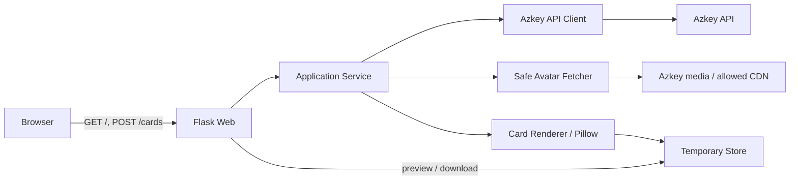

# azkey-card-generator 技術選定・基本設計

- 文書状態: Proposed
- 対象リリース: MVP
- 最終更新: 2026-09-09

## 1. 結論

MVP は、Python の単一 Web アプリケーションとして実装する。

| 領域 | 採用候補 | 方針 |
| --- | --- | --- |
| 言語 | Python 3.13 以上 | 画像処理との親和性と実装の小ささを優先 |
| Web | Flask 3.1 系 | ルート数が少ない同期型アプリに必要十分 |
| HTML | Jinja | サーバーサイドレンダリング |
| ブラウザ | HTML + CSS + 最小限の Vanilla JS | SPA、Node.js ビルドを導入しない |
| 画像生成 | Pillow 12 系 | 合成、リサイズ、角丸、文字計測・描画に使用 |
| HTTP | HTTPX 0.28 系 | タイムアウト、接続プール、テスト差し替えを明示しやすい |
| 本番 WSGI | Gunicorn 23 系 | 複数ワーカー、タイムアウト、終了処理を担う |
| パッケージ管理 | uv + `pyproject.toml` + lockfile | 再現可能な依存解決と高速な CI |
| テスト | pytest | 単体、HTTP 結合、ゴールデン画像テスト |
| 静的検査 | Ruff + mypy | フォーマット、lint、型検査 |
| 配布 | OCI コンテナ | フォントを含む実行環境を固定 |
| 一時保存 | ローカル一時ディレクトリ | MVP は単一レプリカ、既定 TTL 15分 |

実装開始時には lockfile で具体的なバージョンを固定し、更新ツールによる定期更新を行う。
上表の版は設計時点の系列であり、互換性・脆弱性確認なしに固定値として扱わない。

## 2. 選定理由

### 2.1 Python + Flask

- 入力、生成、結果表示の3経路程度で、API スキーマ生成や SPA 用バックエンドを必要としない。
- Flask は Jinja と静的ファイル配信の基本機能を持ち、薄い Web 層を維持できる。
- 同期的な外部 API 呼び出しと CPU 時間の短い画像生成は WSGI ワーカーで扱える。
- アプリケーションサービスを Flask のグローバル状態から分離すれば、将来 ASGI や別 UI へ
  移す場合も中核処理を再利用できる。

### 2.2 Pillow

- アバターのデコード、EXIF 方向補正、切り抜き、縮小、透過合成、PNG 出力を一つの
  ライブラリで扱える。
- TrueType/OpenType フォントによる文字描画、文字領域の計測、アンカー指定ができる。
- 画像の最大バイト数だけでなく、デコード後の最大ピクセル数も検査する。
- 表示の再現性を保つため、OS のフォント探索には依存せずフォントファイルを同梱する。

### 2.3 サーバーサイド HTML

画面遷移とクライアント状態がほぼなく、フォーム POST 後の結果ページだけで要件を満たす。
Jinja と通常の HTTP フォームを基準にすれば、JavaScript は送信中表示や二重送信防止の
漸進的な改善に限定できる。フロントエンド専用のパッケージ管理やビルドは不要とする。

## 3. 採用しない選択肢

| 選択肢 | MVP で採用しない理由 | 再検討条件 |
| --- | --- | --- |
| React / Vue / Next.js | クライアント状態と画面遷移が少なく、ビルド・依存・API 境界が増える | ブラウザ上の高度な編集機能を追加する |
| FastAPI | OpenAPI を提供する外部 API や async 処理が主目的ではない | 公開 JSON API が主要機能になる |
| Celery / Redis | 数秒の同期処理に対して運用対象が増える | 生成が長時間化し、再試行やキュー制御が必要になる |
| PostgreSQL / SQLite | 永続化対象がなく、生成履歴も要件外 | アカウント、履歴、テンプレートを保存する |
| ブラウザ Canvas | フォント差や CORS の影響を受け、出力再現性と外部画像制御が弱くなる | 利用者によるリアルタイム編集を優先する |
| Node.js + Sharp | 実現可能だが、SSR HTML と小規模な画像処理では Python/Pillow の方が構成を小さくできる | チームの TypeScript 運用資産が決定的に大きい |

## 4. システム構成



1プロセス内でも責務を分け、Web フレームワークへの依存を外周へ閉じ込める。

### 4.1 コンポーネント責務

| コンポーネント | 責務 |
| --- | --- |
| Web | 入力受付、HTTP ステータス、HTML/画像レスポンス、リクエスト ID |
| Application Service | ユースケース進行、エラー分類、モデル変換 |
| Azkey API Client | `users/show` 相当の呼び出し、応答検証、Azkey 差分の吸収 |
| Safe Avatar Fetcher | URL/IP/MIME/サイズ検証、制限付きダウンロード |
| Card Renderer | 入力モデルから決定的に PNG バイト列を生成 |
| Temporary Store | ランダム ID で保存、読取、期限判定、削除 |

Web 層から API の生 JSON をテンプレートやレンダラーへ直接渡さず、次のような内部モデルへ
変換する。

```text
CardProfile
  display_name: str
  handle: str
  notes_count: int
  avatar: decoded image | default avatar
  generated_at: timezone-aware datetime
```

## 5. HTTP インターフェース

| Method | Path | 用途 | 成功時 |
| --- | --- | --- | --- |
| GET | `/` | 入力フォーム | 200 HTML |
| POST | `/cards` | 入力検証、取得、生成、保存 | 303 で結果へ |
| GET | `/cards/{artifact_id}` | プレビューと期限表示 | 200 HTML |
| GET | `/cards/{artifact_id}/image` | ブラウザ内プレビュー | 200 image/png |
| GET | `/cards/{artifact_id}/download` | 添付ファイルとして取得 | 200 image/png |
| GET | `/healthz` | プロセス生存確認 | 200 text/plain |
| GET | `/readyz` | 設定・一時領域の利用可否 | 200 / 503 |

- POST 後は Post/Redirect/Get とし、更新操作による再生成を避ける。
- 期限切れは結果ページ・画像とも 410、未知の ID は 404 とする。
- 画像レスポンスは `Cache-Control: private, no-store` を初期値とする。
- `artifact_id` は 128 bit 以上のエントロピーを持つ URL-safe な乱数にする。
- ダウンロード名は固定接頭辞と安全に正規化した名前を使い、ヘッダー注入を防ぐ。

## 6. 外部 API と画像取得

### 6.1 Azkey API

MVP は必須環境変数 `AZKEY_BASE_URL` で指定されたオリジンの `/api/users/show` 相当へ
JSON の POST を行う。例えば `AZKEY_BASE_URL=https://azkey.example.com` なら、接続先は
`https://azkey.example.com/api/users/show` になる。画面入力は `@username` に限定し、
検証後に先頭の `@` を1つ除去して `username` として送る。`host` と内部 `userId` は送らない。
必要な応答項目は `username`、`name`、`host`、`avatarUrl`、`notesCount` とする。

- 認証トークンなしで公開情報を取得できる構成を第一候補とする。
- トークンが必要な Azkey 環境では環境変数または secret mount から注入し、ログへ出さない。
- 接続、読み取り、全体に個別のタイムアウトを設定する。
- 応答 JSON を実行時スキーマで検証し、欠損可能項目に既定動作を定める。
- 404相当、レート制限、5xx、タイムアウト、形式不正を内部エラー型へ変換する。
- 上流への自動再試行は接続失敗と一部 5xx に限定し、短いバックオフで最大1回とする。

### 6.2 アバター取得

API が返した URL であっても信頼済みとは扱わない。

- 許可 scheme は HTTPS を既定とし、開発環境のみ明示設定で HTTP を許可する。
- ホストは Azkey のオリジンと設定済み CDN allowlist に限定する。
- DNS 解決結果が loopback、private、link-local、multicast、reserved の場合は拒否する。
- リダイレクトは既定で拒否する。許可する場合も各遷移先を同じ規則で再検証する。
- 圧縮後の受信上限、Content-Type、デコード後ピクセル数を検査する。
- SVG は受け付けず、MVP は PNG/JPEG/WebP のラスター画像だけをデコードする。
- 失敗時はカード生成全体を失敗させず、既定アバターへフォールバックする。

## 7. 一時保存と削除

### 7.1 MVP 実装

- 専用ディレクトリ配下に `<artifact_id>.png` と最小限のメタデータを保存する。
- ファイルは一時名へ書き、同一ファイルシステム内の rename で公開して部分読取を防ぐ。
- 保存時刻または期限をメタデータとして保持し、期限判定をファイル名に依存させない。
- バックグラウンド清掃を定期実行し、起動時にも期限切れを削除する。
- 取得時にも期限を検査するため、清掃間隔中の期限切れを公開しない。
- 容量上限を設け、超過時は期限切れと古い生成物を優先削除する。

### 7.2 スケール時の境界

`ArtifactStore` をインターフェース化する。複数レプリカが必要になった時点で、共有
オブジェクトストレージと TTL ライフサイクルへ置き換える。ローカル保存のまま複数
レプリカにはせず、sticky session を正しさの前提にしない。

## 8. 設定

| 環境変数（案） | 必須 | 内容 |
| --- | --- | --- |
| `AZKEY_BASE_URL` | yes | 唯一の接続先オリジン。例: `https://azkey.example.com` |
| `AZKEY_API_TOKEN` | no | 必要な環境のみ secret として注入 |
| `AVATAR_ALLOWED_HOSTS` | yes | カンマ区切りのメディア許可ホスト |
| `ARTIFACT_DIR` | no | 生成物ディレクトリ。既定 `/tmp/azkey-cards` |
| `ARTIFACT_TTL_SECONDS` | no | 既定 `900` |
| `ARTIFACT_MAX_BYTES` | no | 一時領域のアプリ上限 |
| `DISPLAY_TIMEZONE` | no | 既定 `Asia/Tokyo` |
| `RATE_LIMIT_PER_MINUTE` | no | 既定 `10` |
| `LOG_LEVEL` | no | 既定 `INFO` |

環境変数名と既定値は実装時に設定クラスとサンプル env ファイルで一元管理する。
`AZKEY_BASE_URL` は起動時に検証し、ユーザー情報、クエリ、フラグメント、`/api` を含む値は
拒否する。未設定または不正なら、誤った接続先でサービスを開始せず起動失敗とする。

## 9. 推奨ディレクトリ構成

```text
src/azkey_card_generator/
  app.py                 # application factory
  config.py
  web/
    routes.py
    templates/
    static/
  domain/
    models.py
    errors.py
  services/
    generate_card.py
  adapters/
    azkey_client.py
    avatar_fetcher.py
    pillow_renderer.py
    local_artifact_store.py
assets/
  fonts/
  images/
tests/
  unit/
  integration/
  golden/
```

小規模な間は抽象化を増やしすぎず、外部 HTTP、時刻、乱数、一時保存、画像生成という
副作用の境界だけを差し替え可能にする。

## 10. テスト戦略

- **単体テスト**: 入力正規化、表示名 fallback、数値整形、文字収容、期限判定、URL/IP 検証。
- **HTTP 結合テスト**: Flask test client と HTTP モックを使い、正常系とエラー変換を確認。
- **ゴールデン画像**: 固定フォント、固定時刻、固定アバターで代表 PNG を生成し、差分を検査。
  OS/圧縮差を避けるため、必要に応じてピクセル差と許容値で比較する。
- **契約テスト**: 機密情報を除去した Azkey レスポンス fixture でデシリアライズを確認。
- **セキュリティテスト**: private IP、リダイレクト、巨大レスポンス、画像爆弾、壊れた画像、
  パストラバーサル、ヘッダー注入を確認。
- **コンテナ smoke test**: 非 root、read-only rootfs、一時領域のみ書込可能な条件で生成する。

## 11. デプロイ方針

- multi-stage build の OCI イメージを作り、アプリ、固定依存、必要なフォントだけを含める。
- 非 root ユーザー、read-only root filesystem、専用 tmpfs/ephemeral volume で実行する。
- Gunicorn のワーカー数は CPU と画像生成時のメモリ実測から決める。ワーカーごとの
  メモリ上限を見込み、過剰な並列化をしない。
- HTTP のボディ上限、同時接続数、レート制限はアプリだけでなくリバースプロキシでも設ける。
- MVP は1レプリカとし、ローリング更新時に既存生成物が失われ得ることを許容する。
- graceful shutdown の猶予を生成処理の最大時間より長く取る。

## 12. 実装順序

1. `AZKEY_BASE_URL` の対象環境で API 互換性を確認し、匿名化した API fixture を確定する。
2. Python プロジェクト、品質ツール、コンテナ、CI の最小構成を作る。
3. 内部モデル、Azkey クライアント、制限付きアバター取得を実装する。
4. 固定データからレンダラーを実装し、ゴールデン画像を確定する。
5. 一時保存、TTL、清掃を実装する。
6. SSR フォーム、結果、エラー画面を接続する。
7. レート制限、ログ、メトリクス、ヘルスチェックを追加する。
8. セキュリティ・ブラウザ・コンテナ smoke test 後に MVP を公開する。

## 13. 技術的な未決事項

- 対象 Azkey の正確な API エンドポイント、認証要否、エラー形式、アバター配信元。
- `AZKEY_BASE_URL` 未設定・不正時にプロセスを起動失敗させる際の運用プラットフォーム側の扱い。
- レート制限を単一プロセス内に置くか、リバースプロキシ側だけで強制するか。
- Prometheus メトリクスを MVP に含めるか、プラットフォームのアクセスログから始めるか。
- ゴールデン画像のピクセル完全一致を採用できる実行環境を CI で固定できるか。
- Noto Sans JP 等の採用フォントと、その配布物に必要なライセンス表記。

## 14. 参考資料

- [Flask documentation](https://flask.palletsprojects.com/en/stable/)
- [Flask installation / supported Python](https://flask.palletsprojects.com/en/stable/installation/)
- [Pillow ImageDraw](https://pillow.readthedocs.io/en/stable/reference/ImageDraw.html)
- [Pillow text anchors](https://pillow.readthedocs.io/en/stable/handbook/text-anchors.html)
- [Misskey API](https://misskey-hub.net/ja/docs/for-developers/api/)
- [Misskey API endpoint documentation notice](https://misskey-hub.net/ja/docs/for-developers/api/endpoints/)
